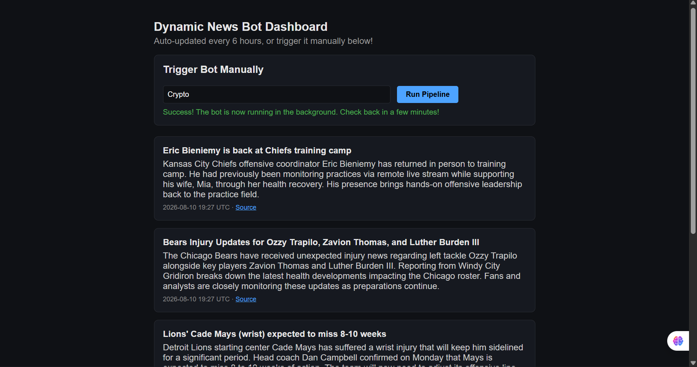
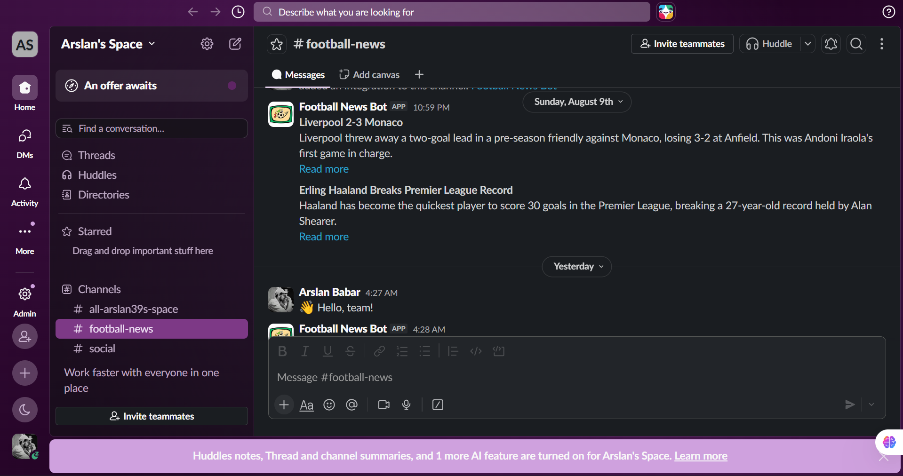
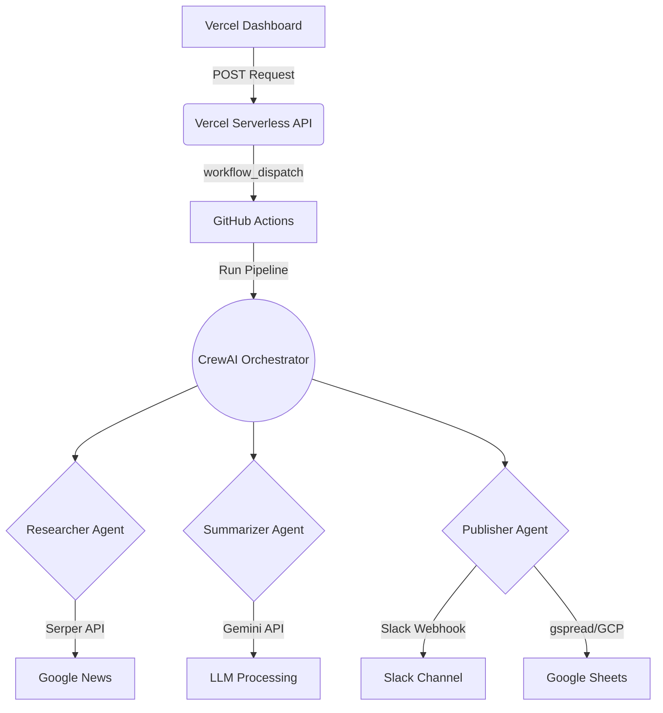

# 🎬 Football News Automation Bot


An intelligent, multi-agent AI workflow that automatically fetches the latest FIFA football (soccer) news, condenses them into clear summaries, posts them to a Slack channel, and archives the records in Google Sheets—all orchestrated by CrewAI and Gemini.

---

## 🌐 Live Demo & Media

- **Live Dashboard App:** [Vercel Deployment](https://news-automation-bot-using-crew-ai-gamma.vercel.app/)
- **Join the Live Slackbot Channel:** [Slack Invite Link](https://join.slack.com/t/arslansspace/shared_invite/zt-46659hp87-0qSlr4W5Qlu7OBiyqYgqXg)

---

## 📸 Screenshots

### 1. Vercel Dashboard


### 2. Slack Bot Updates


### 3. Google Sheets Logging


---

## ✨ Key Features

- **🤖 Multi-Agent Orchestration:** Utilizes CrewAI to manage three specialized AI agents: a Researcher, a Summarizer, and a Publisher.
- **⚡ Ultra-Fast AI:** Powered by the lightweight and blazingly fast `gemini-3.1-flash-lite` model for instantaneous intelligence.
- **🗞️ Live Web Search:** Fetches real-time news data using the Serper API.
- **💬 Slack Integration:** Pushes highly readable, formatted news summaries directly to your team's Slack channel.
- **📊 Google Sheets Archiving:** Securely logs every published article into Google Sheets using Google Cloud Service Accounts.
- **🚀 CI/CD Automation:** Fully automated via GitHub Actions, running on a 6-hour cron schedule or via manual trigger from the Vercel dashboard.

---

## 🛠️ Tech Stack Table

| Technology | Category | Role |
| :--- | :--- | :--- |
| **Python 3.11** | Core | Primary programming language |
| **CrewAI** | AI Framework | Orchestrates the multi-agent pipeline and tool routing |
| **Google Gemini** | LLM | Analyzes and summarizes news articles (`gemini-3.1-flash-lite`) |
| **Serper API** | Search | Fetches the latest Google News results |
| **Slack SDK/Webhooks** | Integration | Delivers the finalized news updates to users |
| **Google Sheets API** | Integration | Persists historical news data into a spreadsheet |
| **GitHub Actions** | CI/CD | Automates the execution of the pipeline |
| **Vercel (Serverless)** | Frontend | Hosts the HTML/JS dashboard and Python trigger API |

---

## ⚙️ How It Works

1. **Trigger:** A user clicks the "Trigger" button on the Vercel dashboard, hitting the serverless Python API.
2. **GitHub Action:** The API dispatches a `workflow_dispatch` event to GitHub Actions, launching the pipeline.
3. **Research Phase:** The `News Researcher` agent searches for "FIFA football (soccer) news today" and retrieves the top 3 results.
4. **Summarization Phase:** The `News Summarizer` agent reads the raw articles and condenses them into 2-3 sentence summaries, stripping out speculation.
5. **Publish Phase:** The `News Publisher` agent uses the `slack_poster` tool to push the updates to Slack, and the `sheets_logger` tool to append the data as a new row in Google Sheets.

---

## 🏗️ Project Architecture



---

## 📂 Project Structure

```text
football-news-bot/
├── .github/
│   └── workflows/
│       └── run_pipeline.yml       # GitHub Actions CI/CD workflow
├── dashboard/
│   └── api/
│       ├── news.py                # Vercel API: Fetches Google Sheets data
│       └── trigger.py             # Vercel API: Triggers the GitHub Action
├── docs/
│   └── assets/                    # UI and integration screenshots
├── pipeline/
│   ├── tools/
│   │   ├── news_fetcher.py        # Serper API integration
│   │   ├── sheets_logger.py       # Google Sheets logging integration
│   │   ├── slack_tool.py          # Slack webhook integration
│   │   └── summarizer.py          # LLM summary formatting
│   ├── main.py                    # CrewAI agents and tasks definition
│   ├── requirements.txt           # Python dependencies
│   └── .env                       # Local environment variables
└── README.md
```

---

## 💻 Local Setup & Installation

### Prerequisites
- Python 3.11+
- Gemini API Key
- Serper API Key
- Slack Webhook URL
- Google Cloud Service Account JSON
- Google Sheet ID

### 1. Clone the repository
```bash
git clone https://github.com/Arslan-Codes097/News-Automation-Bot-using-CrewAI.git
cd News-Automation-Bot-using-CrewAI/football-news-bot
```

### 2. Install Dependencies
```bash
cd pipeline
pip install -r requirements.txt
```

### 3. Setup Environment Variables
Create a `.env` file in the `pipeline` directory:
```env
GEMINI_API_KEY=your_gemini_api_key
SERPER_API_KEY=your_serper_api_key
SLACK_WEBHOOK_URL=your_slack_webhook_url
GOOGLE_SHEET_ID=your_sheet_id
GOOGLE_SERVICE_ACCOUNT_JSON={"type": "service_account", ...}
```

### 4. Run the Pipeline
```bash
python main.py
```

---

## 👤 Author & Credits

Developed by **Arslan**  
[](https://github.com/Arslan-Codes097)
